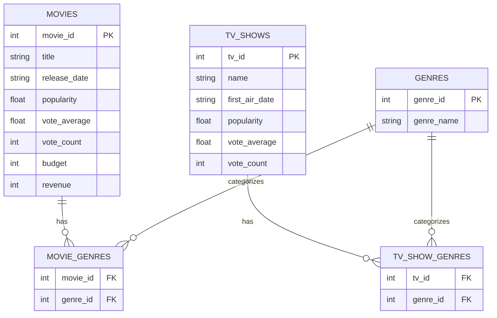

# TMDB Movies & TV Shows – SQL Data Analysis


---

## Table of Contents

1. [Project Overview](#project-overview)
2. [Objectives](#objectives)
3. [Data Source](#data-source)
4. [Data Ingestion](#data-ingestion)
5. [Database Design](#database-design)
6. [Entity Relationship Diagram](#entity-relationship-diagram)
7. [Project Structure](#project-structure)
8. [Next Steps](#next-steps)

---

## Project Overview

This project builds a **custom analytical dataset** using data from *The Movie Database (TMDB)*.
It focuses on **movies and TV shows popularity, genres, and performance metrics**, storing all data
in a **relational SQLite database** to enable structured SQL analysis.

The project is designed with a **consulting and executive reporting mindset**, prioritizing:
- clean data modeling
- reproducible ingestion
- clear analytical questions

---

## Objectives

- Build a reproducible pipeline to ingest data from a public API
- Design a **normalized relational database schema**
- Enable SQL-based analysis for:
  - movies profitability
  - audience demand
  - genre popularity
  - movies vs TV shows comparison
- Prepare the foundation for executive-level KPIs

---

## Data Source

- **API**: The Movie Database (TMDB)
- **Content extracted**:
  - Top 100 most popular movies
  - Top 100 most popular TV shows
- **Granularity**:
  - Full detail per movie / TV show
  - Genre information normalized into relational tables

API credentials are managed using environment variables (`TMDB_API_KEY`).

---

## Data Ingestion

The ingestion process is implemented in Python and follows this flow:

TMDB API → JSON (in memory) → SQLite database


### Key characteristics

- No intermediate CSV files
- Data is inserted directly into SQLite
- Database directory is created programmatically
- The SQLite file is created automatically by the engine
- Progress feedback is shown during execution (CLI)

The ingestion script:
- Resolves absolute paths
- Handles API rate limits
- Prevents duplicate inserts
- Preserves relational integrity

---

## Database Design

The database follows a **normalized relational design**.

Key design decisions:

- Movies and TV shows are stored in separate tables due to domain differences  
  (movies include financial data, TV shows do not).
- Genres are stored in a centralized table.
- Many-to-many relationships are handled using bridge tables.

This structure enables flexible SQL queries and avoids data duplication.

---

## Entity Relationship Diagram


## Project structure

```text

Tmdb_kpis/
│
├── src/
│   └── TMDB_raw_data_collector.py
│
├── db/
│   └── tmdb_content.db
│
├── sql/
│   └── (upcoming cleaning and KPI queries)
│
├── screenshots/
│   └── (query results for README)
│
├── README.md
└── requirements.txt
```