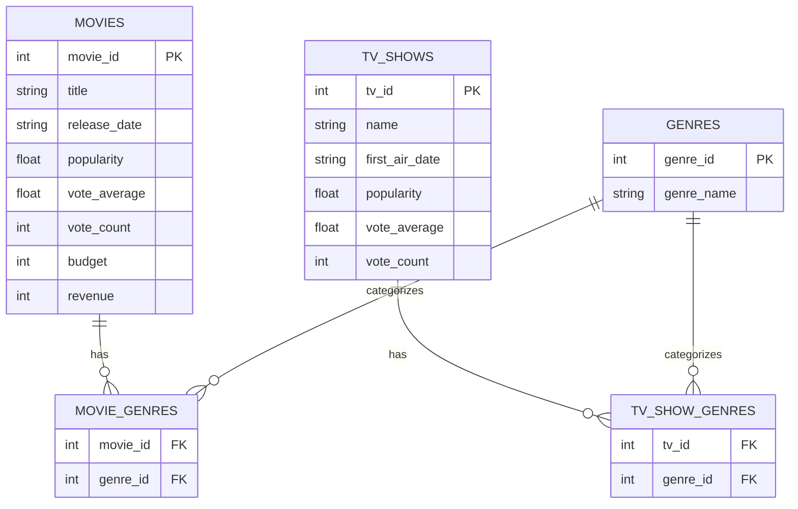
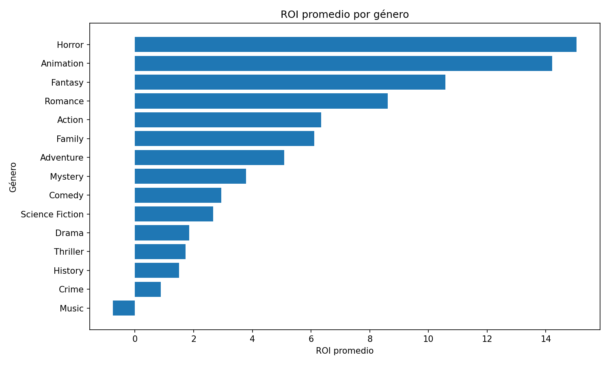

# TMDB Movies & TV Shows – Análisis de Datos con SQL


---

## Tabla de Contenidos

1. [Descripción del Proyecto](#descripción-del-proyecto)
2. [Objetivos](#objetivos)
3. [Fuente de Datos](#fuente-de-datos)
4. [Ingesta de Datos](#ingesta-de-datos)
5. [Diseño de la Base de Datos](#diseño-de-la-base-de-datos)
6. [Diagrama Entidad-Relación](#diagrama-entidad-relación)
7. [Estructura del Proyecto](#estructura-del-proyecto)
8. [Próximos Pasos](#próximos-pasos)

---

## Descripción del Proyecto

Este proyecto construye un **dataset analítico personalizado** utilizando datos de  
*The Movie Database (TMDB)*.

El foco está puesto en el análisis de:
- películas
- series de televisión
- géneros
- métricas de rendimiento y popularidad

Toda la información se almacena en una **base de datos relacional SQLite**, lo que permite
realizar análisis estructurados mediante consultas SQL.

El proyecto fue diseñado con una **mentalidad de consultoría y reporting ejecutivo**, priorizando:
- modelado de datos limpio
- procesos reproducibles
- preguntas analíticas claras y defendibles

---

## Objetivos

- Construir un pipeline reproducible para ingerir datos desde una API pública
- Diseñar un **esquema de base de datos relacional normalizado**
- Habilitar análisis basados en SQL para:
  - rentabilidad de películas
  - demanda del público
  - popularidad por género
  - comparación entre películas y series
- Sentar las bases para KPIs orientados a la toma de decisiones ejecutivas

---

## Fuente de Datos

- **API**: The Movie Database (TMDB)
- **Contenido extraído**:
  - Top 100 películas más populares
  - Top 100 series de TV más populares
- **Nivel de detalle**:
  - Información completa por película / serie
  - Géneros normalizados en tablas relacionales

Las credenciales de la API se gestionan mediante variables de entorno (`TMDB_API_KEY`).

---

## Ingesta de Datos

El proceso de ingesta está implementado en Python y sigue el siguiente flujo:

TMDB API → JSON (in memory) → SQLite database


### Características principales

- No se utilizan archivos CSV intermedios
- Los datos se insertan directamente en SQLite
- El directorio de la base de datos se crea de forma programática
- El archivo SQLite se genera automáticamente por el motor
- Se muestra feedback de progreso durante la ejecución (CLI)

El script de ingesta:
- Resuelve rutas absolutas
- Maneja límites de la API
- Evita inserciones duplicadas
- Preserva la integridad relacional

---

## Diseño de la Base de Datos

La base de datos sigue un **diseño relacional normalizado**.

Decisiones clave de diseño:

- Películas y series se almacenan en tablas separadas debido a diferencias de dominio  
  (las películas incluyen métricas financieras, las series no).
- Los géneros se centralizan en una única tabla.
- Las relaciones muchos-a-muchos se resuelven mediante tablas puente.

Esta estructura permite consultas SQL flexibles y evita duplicación de datos.

---

## Diagrama Entidad-Relación


## Project structure

```text

Tmdb_kpis/
│
├── scripts/
│   ├── data_collector.py
│   ├── plot_kpi2.py
│   └── plot_kpi2.py
├── db/
│   └── tmdb_content.db
│
├── sql/
│   ├── 01_clean.sql
│   └── 02_Movies_kpi.sql
│
├── screenshots/
│  
├── README.md
└── requirements.txt
```

## Análisis y KPIs

### KPI 1 – Películas con mayor Retorno sobre la Inversión (ROI)

Identifica las películas más rentables en relación con su presupuesto.

**Definición:**

\[
ROI = \frac{Revenue - Budget}{Budget}
\]

**Insight clave:**  
Las películas con mayor ROI suelen ser producciones de bajo presupuesto que lograron una fuerte aceptación del público.

---
#### Salida SQL


### KPI 2 – ROI promedio por género

Analiza la rentabilidad promedio de cada género cinematográfico, calculada como el promedio del ROI de sus películas.

#### Visualización



**Interpretación:**  
Se observan diferencias significativas en el ROI promedio entre géneros. Los resultados evidencian una alta variabilidad en la rentabilidad, incluyendo géneros con pérdidas promedio, lo que sugiere estructuras de costos y dinámicas de demanda heterogéneas.

#### Salida SQL


---

### KPI 3 – Películas rentables con alta aceptación del público

Combina las siguientes dimensiones:

- Alta rentabilidad (ROI)
- Buena valoración del público
- Volumen significativo de votos

**Insight clave:** Existen películas que logran combinar éxito financiero con aceptación masiva del público, representando modelos de producción replicables.

---

#### Salida SQL


### KPI 4 – Géneros más rentables y más vistos

Cruza dos dimensiones clave:

- Rentabilidad (ROI promedio)
- Demanda del público (popularidad promedio)

**Insight clave:**  
Los géneros que combinan alta rentabilidad y alta demanda representan oportunidades estratégicas para inversiones sostenibles.

---

#### Salida SQL


#### Visualizacion


## Conclusiones

---

## Estado del Proyecto

✔ Ingesta automatizada  
✔ Base de datos normalizada  
✔ KPIs de películas definidos y documentados  
✔ Visualizaciones reproducibles para KPIs de películas  

⏳ Pendiente:
- Desarrollo de KPIs específicos para TV Shows
- Análisis comparativo entre películas y series
- Cierre final del proyecto con conclusiones integradas

